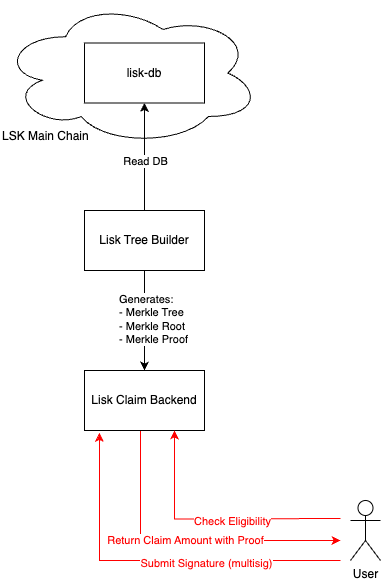

# Documentation <!-- omit in toc -->

- [Token Claim Flow Diagram](#token-claim-flow-diagram)
- [Requirements](#requirements)
  - [Requirement for Tree Builder](#requirement-for-tree-builder)
  - [Requirement for Claim Backend](#requirement-for-claim-backend)

## Token Claim Flow Diagram

## Requirements

This document states the general requirement of each library in this monorepo.

### Requirement for Tree Builder

- Should read all account balances from Lisk Blockchain directly.
- Should build Merkle Tree and Proof according to accounts gathered from Blockchain.

### Requirement for Claim Backend

- Should response corresponding Merkle Leaf correctly upon request.
- Should store partial signatures for multi-signature claims.
- Should calculate readiness for individual multi-signature account.
